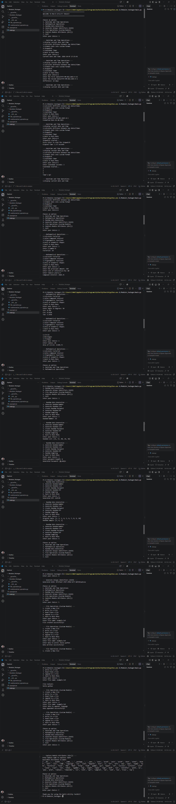

# 🚀 Modular & Packager

### Python Modules & Packages Project

**Developed by:** TANVI HIRAPARA  
**Version:** v1.0.0  
**Language:** Python 3.x  
**Project Type:** Modules & Packages  

---

## 📌 About the Project

**Modular & Packager** is a menu-driven Python **Multi-Utility Toolkit** that combines different useful utilities into one application.

The project is created to demonstrate the practical use of **Python Modules, Custom Modules, Functions, Packages, File Handling, Exception Handling, and Built-in Python Libraries**.

The main program provides different options for:

- Datetime and Time Operations
- Mathematical Operations
- Random Data Generation
- UUID Generation
- File Operations
- Module Attribute Exploration

The project separates different operations into custom modules, making the program easier to understand, maintain, and reuse.

---

# ✨ Features

## 🕒 1. Datetime and Time Operations

The project provides the following datetime and time utilities:

- Display Current Date and Time
- Calculate Difference Between Two Dates
- Format Date into Custom Format
- Stopwatch
- Countdown Timer

The project uses Python's `datetime` and `time` modules for these operations.

---

## 🧮 2. Mathematical Operations

Mathematical operations are implemented using the custom module:

`mathematical_operation.py`

Available operations:

- Calculate Factorial
- Solve Compound Interest
- Trigonometric Functions
  - Sin
  - Cos
  - Tan
- Area of Circle
- Area of Rectangle
- Area of Triangle

The module uses Python's built-in `math` library.

---

## 🎲 3. Random Data Generation

The project uses Python's `random` module for different random-data operations.

Available options:

- Generate Random Number
- Generate Random List
- Create Random Password
- Generate Random OTP
- Random Sampling

The project also uses the `string` module for generating password characters.

---

## 🔑 4. Generate Unique Identifiers

The project uses Python's `uuid` module to generate a unique identifier.

The project uses:

`uuid.uuid4()`

to generate a random UUID.

Example:

`Generated UUID: xxxxxxxx-xxxx-xxxx-xxxx-xxxxxxxxxxxx`

---

## 📁 5. File Operations

File operations are implemented using the custom module:

`file_operation.py`

Available operations:

- Create a New File
- Write to a File
- Read from a File
- Append to a File

The module uses Python's file handling functionality and exception handling to manage file-related errors.

---

## 🔍 6. Explore Module Attributes

The project demonstrates the use of:

`importlib`

and:

`dir()`

The user can enter a Python module name and view the available attributes of that module.

The project dynamically imports the module using:

`importlib.import_module()`

and displays its available attributes using:

`dir(module)`

Example:

`Enter module name to explore: math`

---

# 📂 Project Structure

```text
Modular & Packager/
│
├── main.py
│
└── Moduler_Packager/
    ├── mathematical_operation.py
    └── file_operation.py
```

---

# 📄 File Description

## `main.py`

`main.py` is the main program file.

It contains the main menu and connects all the different operations.

The built-in modules used in this file are:

- `datetime`
- `time`
- `math`
- `random`
- `uuid`
- `string`
- `importlib`

The custom modules are imported using:

```python
from Moduler_Packager.file_operation import file_operation
from Moduler_Packager.mathematical_operation import mathematical_operation
```

The main menu contains:

```text
1. Datetime and Time Operations
2. Mathematical Operations
3. Random Data Generation
4. Generate Unique Identifiers (UUID)
5. File Operations (Custom Module)
6. Explore Module Attributes (dir())
7. Exit
```

The program starts from the `main()` function.

---

## `mathematical_operation.py`

This is a custom module used for mathematical operations.

It provides:

- Factorial
- Compound Interest
- Trigonometric Functions
- Area of Circle
- Area of Rectangle
- Area of Triangle

It uses the Python `math` module.

---

## `file_operation.py`

This is a custom module used for file handling operations.

It provides:

- Create a New File
- Write to a File
- Read from a File
- Append to a File

It uses Python's built-in `open()` function.

---

# 🛠️ Technologies Used

| Technology / Module | Purpose |
|---|---|
| Python 3.x | Main programming language |
| `datetime` | Date and time operations |
| `time` | Stopwatch and countdown |
| `math` | Mathematical calculations |
| `random` | Random data generation |
| `uuid` | Unique identifier generation |
| `string` | Password character generation |
| `importlib` | Dynamic module importing |
| File Handling | Create, read, write and append files |
| `dir()` | Explore module attributes |

---

# 📦 Requirements

The project requires:

```text
Python 3.x
```

All modules used in this project are Python standard-library modules.

Therefore, no external package installation is required.

---

# ⚙️ Installation

## Step 1: Install Python

Make sure Python 3.x is installed on your computer.

Check the installed Python version:

```bash
python --version
```

## Step 2: Open the Project

Open the project folder in **Visual Studio Code** or another Python IDE.

Make sure the project structure is:

```text
Modular & Packager/
│
├── main.py
│
└── Moduler_Packager/
    ├── mathematical_operation.py
    └── file_operation.py
```

---

# ▶️ How to Run

Open the terminal inside the project folder.

Run the following command:

```bash
python main.py
```

The program will display the main menu.

Select an option by entering the corresponding number.

---

# 🖥️ Main Menu

When the program starts, it displays:

```text
==================================================
WELCOME TO MULTI-UTILITY TOOLKIT
==================================================

Choose an option:
1. Datetime and Time Operations
2. Mathematical Operations
3. Random Data Generation
4. Generate Unique Identifiers (UUID)
5. File Operations (Custom Module)
6. Explore Module Attributes (dir())
7. Exit

Enter your choice:
```

---

# 📸 Project Output

The following screenshot shows the actual output of the **Modular & Packager** project.



The output demonstrates the working of:

- Datetime and Time Operations
- Mathematical Operations
- Random Data Generation
- UUID Generation
- File Operations
- Module Attribute Exploration
- Main Menu
- Different operation results

---

# 📚 Python Concepts Used

This project demonstrates several important Python concepts:

### Modules

The project uses Python built-in modules:

```python
import datetime
import time
import math
import random
import uuid
import string
import importlib
```

### Custom Modules

The project contains:

```text
mathematical_operation.py
file_operation.py
```

### Functions

Different operations are divided into separate functions such as:

```text
datetime_operations()
random_operations()
uuid_operations()
explore_module()
mathematical_operation()
file_operation()
```

### Loops

`while` loops are used to repeatedly display menus until the user chooses to go back or exit.

### Conditional Statements

`if`, `elif`, and `else` statements are used to perform operations according to the user's choice.

### Exception Handling

`try` and `except` blocks are used to handle errors during file operations and module importing.

### File Handling

The project uses:

```python
open()
```

with different modes:

```text
w → Write
r → Read
a → Append
```

### Date and Time

The project uses:

```python
datetime.datetime.now()
```

to get the current date and time.

It also uses:

```python
datetime.datetime.strptime()
```

to convert a date string into a datetime object.

### Random Module

The project uses:

```python
random.randint()
random.choice()
random.sample()
```

for random data generation.

### UUID Module

The project uses:

```python
uuid.uuid4()
```

to generate a unique identifier.

### `importlib`

The project uses:

```python
importlib.import_module()
```

to dynamically import a module entered by the user.

### `dir()`

The project uses:

```python
dir(module)
```

to display the available attributes of a module.

### `__name__ == "__main__"`

The project uses:

```python
if __name__ == "__main__":
    main()
```

to start the main program when `main.py` is executed directly.

---

# 🎯 Learning Objectives

This project helps in understanding:

- How Python modules work
- How custom modules are created
- How modules are imported
- How packages organize modules
- How Python standard-library modules are used
- How functions organize program logic
- How menu-driven programs work
- How loops and conditions are used
- How files are created and handled
- How exceptions are handled
- How random data is generated
- How UUIDs are generated
- How `importlib` works
- How the `dir()` function is used
- How a Python project can be organized using modules and packages

---

# 🌟 Project Highlights

```text
✔ Menu-Driven Python Program
✔ Python Modules
✔ Custom Modules
✔ Package Structure
✔ Date & Time Operations
✔ Mathematical Operations
✔ Random Data Generation
✔ Random Password Generation
✔ Random OTP Generation
✔ UUID Generation
✔ File Handling
✔ Module Attribute Exploration
✔ Exception Handling
✔ Built-in Python Libraries
✔ Beginner-Friendly Structure
```

---

# 🚀 Future Improvements

The project can be extended in the future by adding:

- More mathematical operations
- More file management options
- Additional date and time utilities
- More random-data features
- More UUID operations
- Improved error handling
- Additional custom modules
- More utility functions
- Improved user interface

---

# 👩‍💻 Author

## TANVI HIRAPARA

**Python Student / Developer**

This project was developed to practice and understand **Python Modules and Packages** along with different built-in Python libraries.

---

# 📌 Version

**Current Version:** `v1.0.0`

### Version History

| Version | Description |
|---|---|
| v1.0.0 | Initial release of Modular & Packager |

---

# 📜 License

This project is created for **educational and learning purposes**.

---

# ❤️ Thank You

Thank you for checking out the **Modular & Packager** project!

If you find this project useful, you can give the repository a star.